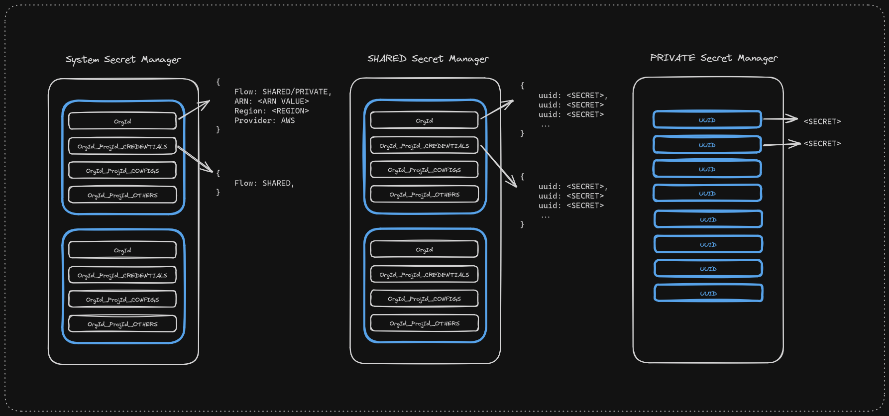

<h1 align="center">SECRET SERVICE</h1>

## Development .ENV config

```bash
PORT=8080
REGION="ap-southeast-2"
BASE=localhost
# GIN_MODE=release

SHARED_SECRET_MNGR_ARN=<"SHARED SECRET MANAGER ARN">
ASSUME_ROLE_SESSION_NAME=AssumeRoleSession

# Disable/Remove in Prod env
DISABLE_LOGS=true
BYPASS_REDIS=true

# Redis Options
REDIS_HOST="localhost"
REDIS_PORT=6379
REDIS_PASSWORD=""
REDIS_LAZY_CONNECT=true
```

## Running the app

```bash
# run
$ go run .
```

## Introduction

The secret microservice provides a generic API created using the GO language to get, post, put, or delete a secret provided the request is to utilize a Skyu-owned, shared secret store or to access a client-owned secret store. This service is not exposed via the public API Gateway for the SkyU front-end and is only used via the other Microservices, hence the requests are assumed to be authorized.

## Why do we need the feature?

- As a Generic API to access client secrets in a secure and independent way.
- As a service to utilize a shared secret store for clients who do not own pre-existing secret stores.
- As a service to access and manage client secrets from client-owned secret stores.
- As a service to manage and utilize secrets at an Organization or project level.

## Stakeholders

Developers can use a Generic API to utilize various secret stores. Moreover, Clients are given the flexibility to choose where they want to manage their secrets, in a shared secret store or their own secret stores building trust on the Skyu platform.

## Feature Support

| Feature                     | Description                                                                                                                          | Status             |
| :-------------------------- | :----------------------------------------------------------------------------------------------------------------------------------- | :----------------- |
| System Secret Manager       | This Secret manager stores metadata needed for accessing the actual Secret Manager using `Organization ID`, `Project ID` and `Scope` | :white_check_mark: |
| Shared Secret Manager       | A Shared Secret Manager which can be used to manage client secrets onces registered in the System Secret Manager                     | :white_check_mark: |
| Client Owned Secret Manager | Accessing and Managing secrets using Client owned secret managers                                                                    | :white_check_mark: |

## Architecture


